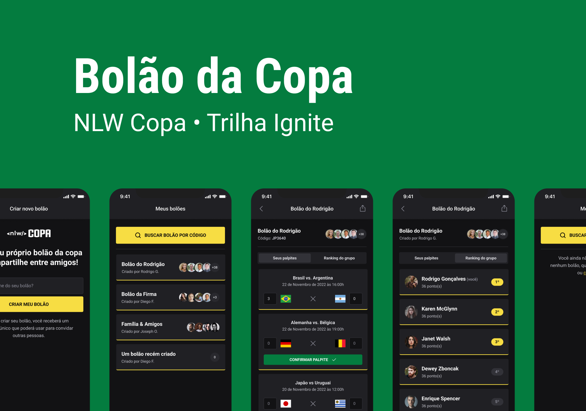
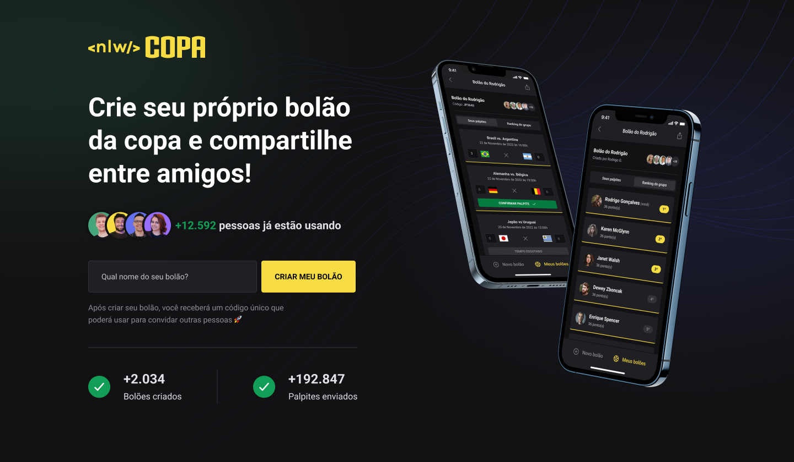

<h1 align="center">
    
</h1>

<p align="center">
  

  
  
  <a href="https://github.com/joao0pedro0alves/nlw-copa/commits/master">
    
  </a>
    
   

   <a href="https://github.com/joao0pedro0alves/nlw-copa/stargazers">
    
  </a>
</p>

<p>
  
</p>

<h4 align="center"> 
	🚧  NLW Copa Em desenvolvimento 🚀 🚧
</h4>

<p align="center">
 <a href="#-about">About</a> |
 <!-- <a href="#-funcionalidades">Funcionalidades</a> | -->
 <a href="#-layout">Layout</a> | 
 <a href="#-how-it-works">How It Works</a> | 
 <a href="#-technologies">Technologies</a> | 
 <!-- <a href="#-contribuidores">Contribuidores</a> |  -->
 <a href="#-author">Author</a> | 
 <a href="#-license">License</a>
</p>


## 💻 About

O NLW Copa é uma aplicação com parte web, back-end e mobile, que tem como função a realização de bolões a respeito das partidas de jogos da copa do mundo, no qual esses bolões podem ser realizados entre conhecidos, amigos e até familiares.

O projeto foi desenvolvido durante a **NLW - Next Level Week** oferecida pela [Rocketseat](https://blog.rocketseat.com.br/primeira-next-level-week/). O NLW é uma experiência online com muito conteúdo prático, desafios e hacks onde o conteúdo fica disponível durante uma semana.

Desenvolvi por conta própria algumas features novas para a plataforma Web, como autenticação com JWT e novas telas.

---

<!-- ## ⚙️ Funcionalidades

- [x] Empresas ou entidades podem se cadastrar na plataforma web enviando:
  - [x] uma imagem do ponto de coleta
  - [x] nome da entidade, email e whatsapp
  - [x] e o endereço para que ele possa aparecer no mapa
  - [x] além de selecionar um ou mais ítens de coleta: 
    - lâmpadas
    - pilhas e baterias
    - papéis e papelão
    - resíduos eletrônicos
    - resíduos orgânicos
    - óleo de cozinha

- [x] Os usuários tem acesso ao aplicativo móvel, onde podem:
  - [x] navegar pelo mapa para ver as instituições cadastradas
  - [x] entrar em contato com a entidade através do E-mail ou do WhatsApp

--- -->

## 🎨 Layout

Você pode visualizar o layout do projeto através [desse link](https://www.figma.com/community/file/1169028343875283461). É necessário ter conta no [Figma](https://www.figma.com/) para acessá-lo.

### Web

<p align="center">
  
</p>

### Mobile

<p align="center">
  
</p>

---

## 🚀 How it works

Este projeto é divido em três partes:
1. Backend (pasta server) 
2. Frontend (pasta web)
3. Mobile (pasta mobile)

💡Tanto o Frontend quanto o Mobile precisam que o Backend esteja sendo executado para funcionar.

### Pré-requisitos

Antes de baixar o projeto você vai precisar ter instalado na sua máquina as seguintes ferramentas:

* [Git](https://git-scm.com)
* [NodeJS](https://nodejs.org/en/)
* [Yarn](https://yarnpkg.com/) ou [NPM](https://www.npmjs.com/)

Além disto é bom ter um editor para trabalhar com o código como [VSCode](https://code.visualstudio.com/)

#### 🎲 Rodando o Backend (servidor)

```bash
# Clone este repositório
$ git clone https://github.com/joao0pedro0alves/nlw-copa.git

# Acesse a pasta do projeto no terminal/cmd
$ cd nlw-copa

# Vá para a pasta server
$ cd server

# Instale as dependências
$ npm install

# Execute a aplicação em modo de desenvolvimento
$ npm run dev

# O servidor inciará na porta:3333 - acesse http://localhost:3333 
```

#### 🧭 Rodando a aplicação web (Frontend)

```bash
# Vá para a pasta da aplicação Front End
$ cd web

# Instale as dependências
$ npm install

# Execute a aplicação em modo de desenvolvimento
$ npm run dev

# A aplicação será aberta na porta:3000 - acesse http://localhost:3000
```

#### 📱 Rodando a aplicação mobile (Mobile)

```bash
# Vá para a pasta da aplicação mobile
$ cd mobile

# Instale as dependências
$ npm install

# Execute a aplicação em modo de desenvolvimento
$ npx expo start
```

---

## 🛠 Technologies

As seguintes ferramentas foram usadas na construção do projeto:

#### **Website**  ([Next](https://nextjs.org/)  +  [TypeScript](https://www.typescriptlang.org/))

-   **[TailwindCSS](https://tailwindcss.com/)**
-   **[PostCSS](https://postcss.org/)**
-   **[Axios](https://github.com/axios/axios)**

> Veja o arquivo  [package.json](https://github.com/joao0pedro0alves/nlw-copa/blob/main/web/package.json)

#### **Server**  ([NodeJS](https://nodejs.org/en/)  +  [TypeScript](https://www.typescriptlang.org/))

-   **[Fastify](https://www.fastify.io/)**
-   **[Zod](https://github.com/colinhacks/zod)**
-   **[Short-Unique-Id](https://www.npmjs.com/package/short-unique-id)**
-   **[Prisma](https://www.prisma.io/)**
-   **[SQLite](https://github.com/mapbox/node-sqlite3)**

> Veja o arquivo  [package.json](https://github.com/joao0pedro0alves/nlw-copa/blob/main/server/package.json)

#### **Mobile**  ([React Native](http://www.reactnative.com/)  +  [TypeScript](https://www.typescriptlang.org/))
 
-   **[Expo](https://expo.io/)**
-   **[Expo Fonts](https://docs.expo.dev/guides/using-custom-fonts/)**
-   **[Expo Google Fonts](https://github.com/expo/google-fonts)**
-   **[Expo Auth Session](https://docs.expo.dev/versions/latest/sdk/auth-session/)**
-   **[Expo Web Browser](https://docs.expo.dev/versions/latest/sdk/webbrowser/)**
-   **[Native Base](https://nativebase.io/)**
-   **[Phosphor React Native](https://github.com/duongdev/phosphor-react-native)**
-   **[React Navigation](https://reactnavigation.org/)**
-   **[React Native SVG](https://github.com/react-native-community/react-native-svg)**
-   **[React Native Country Flag](https://www.npmjs.com/package/react-native-country-flag)**
-   **[Axios](https://github.com/axios/axios)**
-   **[Country-List](https://www.npmjs.com/package/country-list)**
-   **[DayJS](https://day.js.org/)**
-   **[dotENV](https://www.npmjs.com/package/dotenv)**

> Veja o arquivo  [package.json](https://github.com/joao0pedro0alves/nlw-copa/blob/main/mobile/package.json)

---
<!-- 
## 👨‍💻 Contribuidores

💜 Um super thanks 👏 para essa galera que fez esse produto sair do campo da ideia e entrar nas lojas de aplicativos :)

<table>
  <tr>
    <td align="center"><a href="https://rocketseat.com.br"><br /><sub><b>Diego Fernandes</b></sub></a><br /><a href="https://rocketseat.com.br/" title="Rocketseat">👨‍🚀</a></td>
    <td align="center"><a href="https://rocketseat.com.br"><br /><sub><b>Cleiton Souza</b></sub></a><br /><a href="https://rocketseat.com.br/" title="Rocketseat">👨‍🚀</a></td>
    <td align="center"><a href="https://rocketseat.com.br"><br /><sub><b>Robson Marques</b></sub></a><br /><a href="https://rocketseat.com.br/" title="Rocketseat">👨‍🚀</a></td>
    <td align="center"><a href="https://rocketseat.com.br"><br /><sub><b>Claudio Orlandi</b></sub></a><br /><a href="https://rocketseat.com.br/" title="Rocketseat">🚀</a></td>
    <td align="center"><a href="https://rocketseat.com.br"><br /><sub><b>Vinícios Fraga</b></sub></a><br /><a href="https://rocketseat.com.br/" title="Rocketseat">🚀</a></td>
    <td align="center"><a href="https://rocketseat.com.br"><br /><sub><b>Hugo Duarte</b></sub></a><br /><a href="https://rocketseat.com.br/" title="Rocketseat">🚀</a>  <a href="https://blog.rocketseat.com.br/" title="Blog">🌐</a></td>
    
  </tr>
  <tr>
    <td align="center"><a href="https://rocketseat.com.br"><br /><sub><b>Joseph Oliveira</b></sub></a><br /><a href="https://rocketseat.com.br/" title="Rocketseat">🚀</a></td>
    <td align="center"><a href="https://rocketseat.com.br"><br /><sub><b>Guilherme Rodz</b></sub></a><br /><a href="https://rocketseat.com.br/" title="Rocketseat">🚀</a></td>
    <td align="center"><a href="https://rocketseat.com.br"><br /><sub><b>Mayk Brito</b></sub></a><br /><a href="https://rocketseat.com.br/" title="Rocketseat">🚀</a></td>
    <td align="center"><a href="https://rocketseat.com.br"><br /><sub><b>João Paulo</b></sub></a><br /><a href="https://rocketseat.com.br/" title="Rocketseat">🚀</a></td>
    <td align="center"><a href="https://rocketseat.com.br"><br /><sub><b>Luke Morales</b></sub></a><br /><a href="https://rocketseat.com.br/" title="Rocketseat">🚀</a></td>
     <td align="center"><a href="https://rocketseat.com.br"><br /><sub><b>Luiz Batanero</b></sub></a><br /><a href="https://rocketseat.com.br/" title="Rocketseat">🚀</a></td>
    
  </tr>
</table> -->


## 👨‍💻 Contribuidores

<table>
  <tr>
    <td align="center"><a href="https://github.com/PabloXT14"><br /><sub><b>Pablo Alan</b></sub></a><br /><a href="https://github.com/PabloXT14" title="Pablo Alan">👨‍🚀</a></td>    
  </tr>
</table>

## 💪 Como contribuir para o projeto

1. Faça um **fork** do projeto.
2. Crie uma nova branch com as suas alterações: `git checkout -b my-feature`
3. Salve as alterações e crie uma mensagem de commit contando o que você fez: `git commit -m "feature: My new feature"`
4. Envie as suas alterações: `git push origin my-feature`
> Caso tenha alguma dúvida confira este [guia de como contribuir no GitHub](./CONTRIBUTING.md)

---

## 🦸 Author

<a href="https://github.com/joao0pedro0alves">
 
 <br />
 <br />
 <sub><strong>João Alves</strong> 🚀</sub>
</a>

<br />
<br />

<a href="https://instagram.com/joaao_alvees" target="_blank"></a>
<a href = "mailto:contato@joao.alves1032003@gmail.com"></a>
<a href="https://www.linkedin.com/in/jo%C3%A3o-pedro-alves-pereira-bb0052216/" target="_blank"></a>

---

## 📝 License

Este projeto esta sobe a licença [MIT](./LICENSE).

Feito com 💜 por João Alves 👋🏽 [Entre em contato!](https://www.linkedin.com/in/jo%C3%A3o-pedro-alves-pereira-bb0052216/)

---
